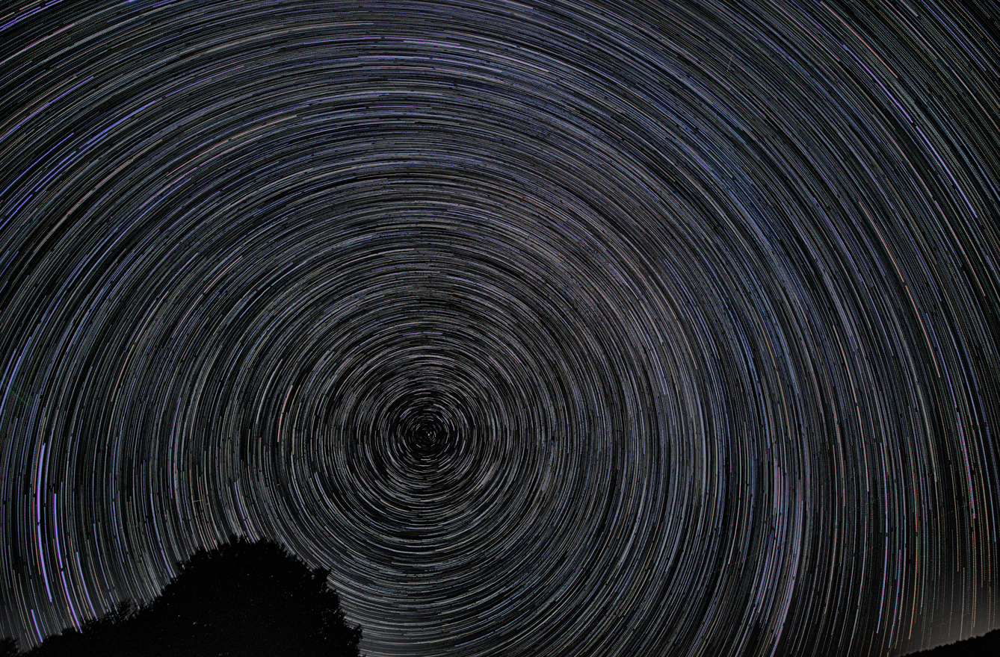
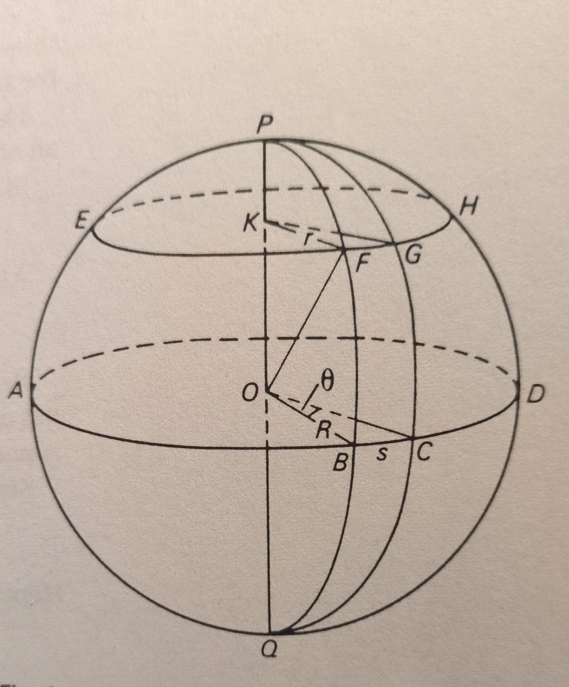
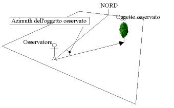
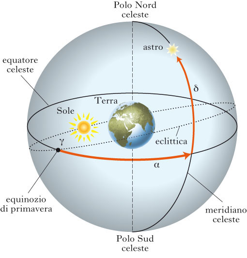
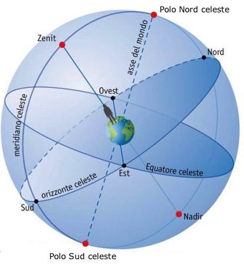
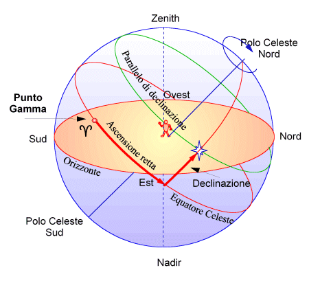
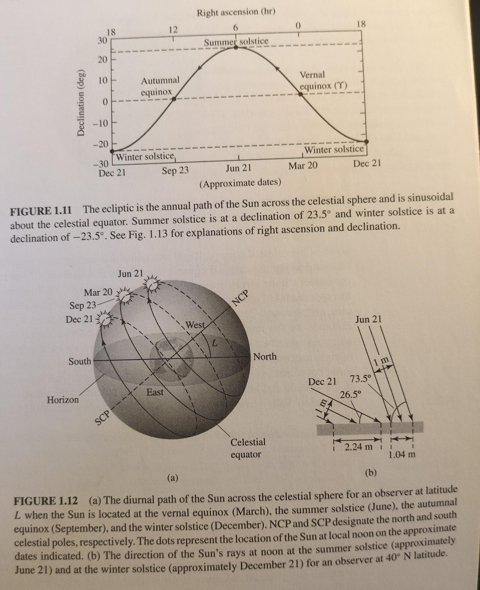

# 🗓️ Informazioni
- **Data creazione:** 2025-10-31 08:47
- **Ultima modifica:** 2025-10-31 08:47
- **Autore:** [[Tiriolo Luca]]

---

# 📋 Obiettivi
- [ ] Definire i concetti basi per misurare la volta celeste
- [ ] Differenza tra sistema altazimutale ed equatoriale
- [ ] Concetti di Astrometria

---
# Indice

- [[Coordinate Altazimutali ed Equatoriali#La Volta Celeste]]
- [[Coordinate Altazimutali ed Equatoriali#Il sistema di coordinate Equatoriali]]
- [[Coordinate Altazimutali ed Equatoriali#Il sistema di coordinate Altazimutali]]

---

# La Volta Celeste

Quanto osserviamo la volta celeste abbiamo la sensazione di trovarci al centro di una semisfera.

Su queste semisfera tutti i corpi celesti ci sembrano proiettati alla stessa distanza.

Per ora ci accontentiamo di questa rappresentazione e andiamo così a misurare gli astri.

La posizione di ciascun astro può essere descritta con due coordinate e dobbiamo considerare che questo sistema di coordinate cambia nel tempo perché la volta celeste si muove ( in realtà è la Terra che ruota).

La branca dell'astronomia che si occupa di calcolare la posizione degli astri sulla sfera celeste è detta **Astrometria**

**Cerchio Massimo** : intersezione della sfera con un piano che PASSA per il suo centro ABCDA
**Cerchio Piccolo** : intersezione della sfera con un piano che NON PASSA per il suo centro EFGHE

Vale il Teorema di Pitagora

$OF^2 = OK^2 + KF^2$

Un triangolo sferico è una figura formata dall’intersezione di tre archi di circoli massimi sulla superficie di una sfera.

Il triangolo *PBC* è un triangolo sferico mentre il triangolo *PFG* non lo è. 

EFGHE è detto **Almucàntarat** (dall' arabo, a volte anche **almucantar** o **almacantara**, è il termine con cui in astronomia si definisce il parallelo della sfera celeste nel sistema di riferimento"Sistema di riferimento") che ha nello zenit il proprio polo nord. Un almucantarat individua, pertanto, i punti aventi la medesima altezza, indicata con _h_.

Vale la relazione
$s = R \times \theta$

Un **[[Meridiano]]** è una semicirconferenza che collega il Polo Nord al Polo Sud, utilizzata nella cartografia per definire la longitudine di un punto sulla Terra.

Il **[[Meridiano locale]]**, o impropriamente meridiano, è il cerchio massimo della sfera celeste passante per i poli celesti e per i poli dell'orizzonte, detti Zenith e Nadir. Può anche pensarsi come la proiezione del meridiano geografico dell'osservatore sulla sfera celeste.

# Il sistema di coordinate Altazimutali

Teniamo presente come si muove un cavalletto fotografico. In alto e in basso. A destra e a sinistra.
Perciò posso specificare solo 2 COORDINATE per identificare la posizione di un oggetto.
Le coordinate sono
- altitudine 
- azimut ( le direzioni in arabo)

| Punto cardinale          | Azimut (gradi) |
|--------------------------|---------------|
| Nord                     | 0° o 360°     |
| Nord-Nordest             | 22,5°         |
| Nordest                  | 45°           |
| Est-Nordest              | 67,5°         |
| Est                      | 90°           |
| Est-Sudest               | 112,5°        |
| Sudest                   | 135°          |
| Sud-Sudest               | 157,5°        |
| Sud                      | 180°          |
| Sud-Sudovest             | 202,5°        |
| Sudovest                 | 225°          |
| Ovest-Sudovest           | 247,5°        |
| Ovest                    | 270°          |
| Ovest-Nordovest          | 292,5°        |
| Nordovest                | 315°          |
| Nord-Nordovest           | 337,5°        |

## Vantaggi 
- facile da capire e usare
## Svantaggi
- difficili da usare con un telescopio in modo manuale
- dipendono dalla latitudine e dalla longitudine (le stella cambiano continuamente posizione)
- Le stelle si alzano ogni giorno 4 minuti prima [[Esercizio 1 - Moti Della Terra]]

# Il sistema di coordinate Equatoriali

In questa immagine vediamo la sfera celeste in prospettiva della Terra. 
L'angolo che si forma tra l'eclittica e l'equatore celeste  è di 23, 5° ed è uno degli elementi fondamentali alla vita.

Ora proiettiamo questo punto di vista nel luogo dove avviene l'osservazione

Quindi se proiettiamo 

Le coordinate sono:

**Declinazione**: l'angolo tra l'equatore celeste e l'oggetto. Si misura in gradi e va da 0 a 90°

**Punto Vernale** o **Punto Gamma** o **Punto d'Ariete** : punto della Sfera Celeste in cui il Sole, nel suo moto apparente annuale, transita sull’Equatore in Primavera

Esercizio con Cartes Du Ciel

[[ESPERIENZA PRATICA Star Trail]] 

## Vantaggi 
- Sono le stesse per ogni osservatore. Se ad esempio qualcuno scopre una nuova cometa, è sufficiente fornire la sua declinazione e ascensione retta per poterla individuare sulla S.C. da parte di chiunque ne abbia interesse, sia che abiti in Australia, Giappone, America ecc.
- posso muovere il telescopio in una sola direzione 
## Svantaggi
- un po' più difficili da comprendere
- non sono proprio fissi nel tempo. Occorre considerare 
	- Moto Proprio delle Stelle
	- [[Processioni degli Equinozi]]
