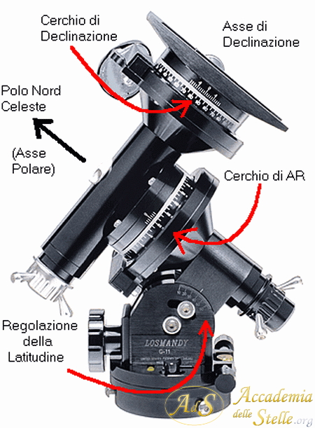
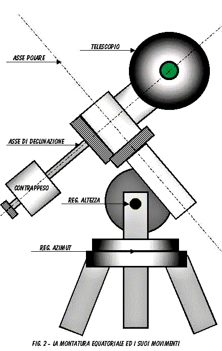
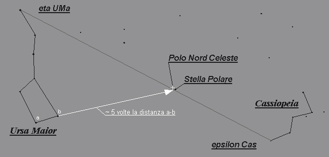

## Funzionamento e Utilizzo Pratico

- Le scale graduate permettono di trovare facilmente un oggetto anche se non visibile ad occhio nudo: si punta prima una stella luminosa di coordinate note, si regola il cerchio in ascensione retta per corrispondere a quelle coordinate mentre la declinazione si imposta sul valore della stella. Poi, senza muovere i cerchi, si sposta il telescopio ruotando i due assi fino a far corrispondere i valori delle scale a quelli dell’oggetto che si vuole osservare. Così facendo il telescopio punterà la zona esatta del cielo.​
    
- La scala di ascensione retta è graduata in ore, minuti e secondi; quella di declinazione in gradi, primi e secondi.
    
- Queste scale sono particolarmente utili su telescopi manuali per trovare oggetti deboli senza la necessità di strumenti elettronici.
    

## Guida Sintetica Passo Passo

-- [[Meridiano]] 
-- [[Meridiano Locale]]

| Passo                      | Azione                                                                           | Risultato                                                                                                                                |
| -------------------------- | -------------------------------------------------------------------------------- | ---------------------------------------------------------------------------------------------------------------------------------------- |
| **1**                      | Gamba verso **Nord geografico**                                                  | Base orientata                                                                                                                           |
| **2**                      | Punta la **Polare nel reticolo** del cercatore polare                            | Asse AR allineato con il polo celeste                                                                                                    |
| **3**                      | Imposti **AR = LST** (senza muovere il telescopio)                               | Cerchio graduato sincronizzato con il cielo                                                                                              |
| **4**                      | Ruoti in **AR verso Est**                                                        | L’AR **aumenta** → oggetti che devono ancora culminare                                                                                   |
|                            | Ruoti in **AR verso Ovest**                                                      | L’AR **diminuisce** → oggetti già passati al meridiano                                                                                   |
| **5**                      | Ruoti in **Declinazione verso Nord** (verso la Polare)                           | **Dec aumenta** → oggetti più vicini al polo nord celeste                                                                                |
| **6**                      | Ruoti in **Declinazione verso Sud** (verso l’equatore celeste e oltre)           | **Dec diminuisce** → oggetti più lontani dal polo nord celeste                                                                           |
| **7**                      | Quando **Dec = 0°**                                                              | Stai puntando l’**equatore celeste**                                                                                                     |
| **8**                      | Quando **Dec = latitudine – 90°** (≈ -52° se sei a 38°N)                         | Stai puntando l’**orizzonte Sud**                                                                                                        |
| **9**                      | Quando **Dec = +90°**                                                            | Stai puntando il **Polo Nord celeste**. Sblocca la **scala graduata della Dec** (di solito si può ruotare a mano) e mettila su **+90°**. |
| **10. Test (facoltativo)** | Ruota in Dec fino a 0° → dovresti puntare verso l’**equatore celeste** (Dec=0°). | Ad esempio, la stella Mintaka (una delle tre del Cinturone di Orione) ha Dec ≈ 0°.                                                       |

quando LST = 10h, sul **tuo meridiano locale** passa l’oggetto con **AR = 10h**.
