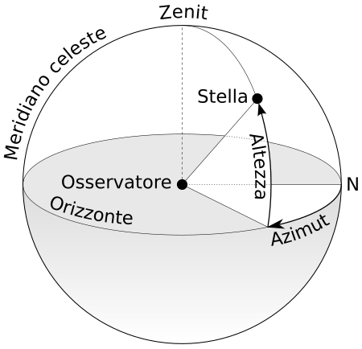

Il **[[Meridiano locale]]** è il cerchio massimo della sfera celeste passante per i poli celesti e per i poli dell'orizzonte, detti Zenith e Nadir. Può anche pensarsi come la proiezione del meridiano geografico dell'osservatore sulla sfera celeste.

