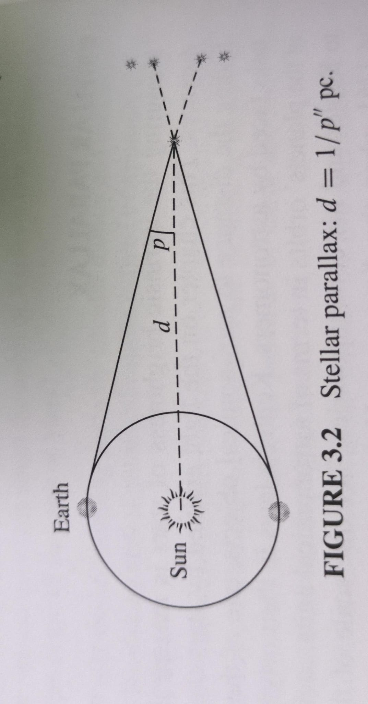
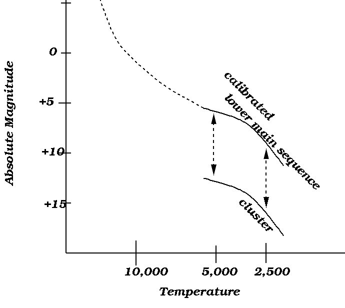
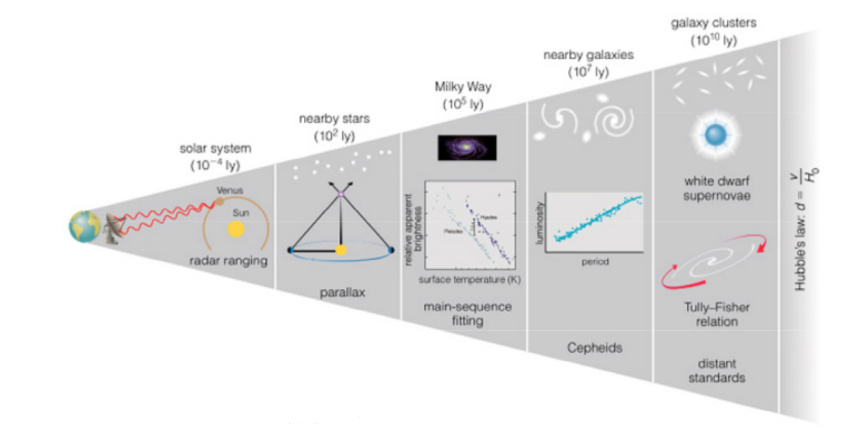

# Untitled

## 🗓️ Informazioni
- **Data creazione:** 2025-11-01 09:13
- **Ultima modifica:** 2025-11-01 09:13
- **Autore:** [[Tiriolo Luca]]

---

# Indice
- [[La misura delle distanze#Parallasse Trigonometrica]]
- [[La misura delle distanze#Il fitting della sequenza principale]]
- [[La misura delle distanze#Candele Standard]]
- [[La misura delle distanze#Relazione Tully Fisher]]

---

# Parallasse Trigonometrica

Misurare la luminosità intrinseca di una stella è legata alla sua distanza.

Uno dei compiti più difficile per un astronomo è definire le distanze.

Uno dei metodi più utilizzati è la parallasse trigonometrica

 Il metodo della parallasse trigonometrica è basato sul moto annuale apparente delle stelle causato dal moto orbitale della Terra. Con questo metodo possiamo misurare dalla Terra distanze fino a circa 30 pc;
 

$$d = \frac {d}{\tan p}$$
Approssimando
$$d \approx \frac {d}{ p''}$$

$$d = \frac {206.265}{ p''} AU$$

$$d = \frac {1}{ p''} pc$$

Dove

L' **Unità Astronomica** (AU) è la distanza media tra Terra e Sole

$$1 AU \approx 150\ milioni\ di\ metri \approx 1.5 \cdot 10^{11} \ m  $$

**Parsec** (parallax-second) è la distanza a cui guardo la distanza Terra Solo quando p è 1 secondo d'arco

$$1 pc \approx 30\ mila \ miliardi\ di\ metri \approx 3.0 \cdot 10^{16} \ m  $$

Un anno luce
$$1 ly \approx 9\ milioni \ di \ miliardi\ di\ metri \approx 9.0 \cdot 10^{15} \ m  $$

Perciò

- **1 parsec = 3.26 anni luce = 206 265 AU**
    
- **1 anno luce ≈ 63 241 AU ≈ 0.307 parsec**
    
- **1 AU ≈ 8,3 minuti luce** 

# Il fitting della sequenza principale

Confrontando la **sequenza principale** di un ammasso aperto a distanza nota (ad esempio le _Iadi_) nel diagramma _magnitudine assoluta – colore_, con la sequenza principale nel diagramma _magnitudine apparente – colore_ di un ammasso di cui **non si conosce la distanza**, si può risalire alla distanza di quest’ultimo.

La **quantità di spostamento verticale** necessaria per far coincidere le due sequenze principali è il **modulo di distanza** dell’ammasso aperto a distanza incognita, indicato con **M − m**.

---

### Formula

$m−M=5⋅log⁡(r10 pc)+A(r)m - M = 5 \cdot \log \left( \frac{r}{10\ \text{pc}} \right) + A(r)m−M=5⋅log(10 pcr​)+A(r)$

dove:

- *m* = magnitudine apparente
    
- *M* = magnitudine assoluta
    
- *r* = distanza in parsec
    
- *A(r)* = assorbimento interstellare lungo la linea di vista

# Candele Standard

- Cepheidi
- Supernovae
- GRB

# Relazione Tully Fisher

La relazione di Tully–Fisher (TFR) è una relazione empirica ampiamente verificata tra la massa o la luminosità intrinseca di una galassia a spirale e la sua velocità di rotazione asintotica o la larghezza della riga di emissione. Poiché la luminosità osservata di una galassia dipende dalla distanza, questa relazione può essere utilizzata per stimare le distanze delle galassie a partire dalle misure della loro velocità di rotazione

