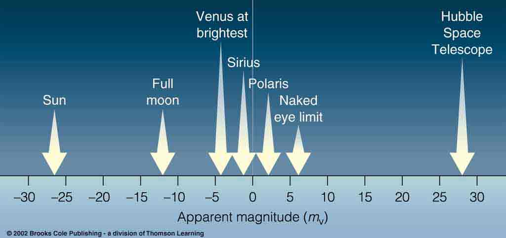
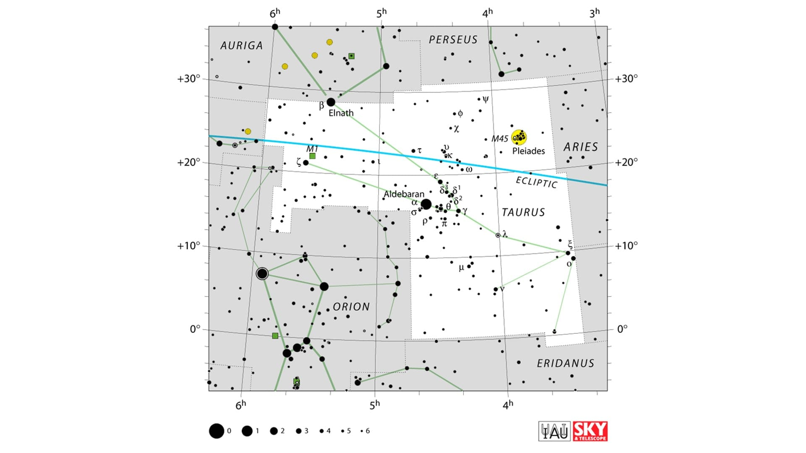
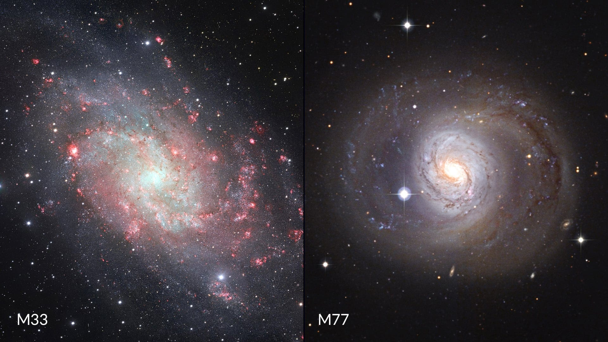

## 🗓️ Informazioni
- **Data creazione:** 2025-11-01 11:52
- **Ultima modifica:** 2025-11-01 11:52
- **Autore:** [[Modifiche Tiriolo Luca]] - Fonte : https://starwalk.space/it/news/what-is-magnitude-in-astronomy

---

Conoscendo la luminosità di un oggetto celeste, puoi determinare se questo oggetto è visibile o meno. Ma come si misura effettivamente questa luminosità? Quale misurazione viene utilizzata in quale caso? Mettiamolo in chiaro così potrai osservare il cielo notturno come un professionista!

## Che cos'è la magnitudine?

In astronomia, **la magnitudine è una misura di quanto un oggetto appare luminoso o tenue nel cielo.** Abbiamo usato il termine “appare” perché la magnitudine non indica la luminosità reale dell’oggetto, ma quanto **appare** luminoso a un osservatore.

Non bisogna mai confondere la magnitudine con la **luminosità** (L) — la potenza totale della luce che un oggetto emette in tutte le direzioni ogni secondo.

Quando gli astronomi parlano di luminosità, specificano solitamente quale parte dello spettro luminoso stanno misurando. La luce è suddivisa in diverse regioni in base alla lunghezza d’onda, come ultravioletta (corta), blu o visibile (quella che l’occhio umano percepisce). Per misurazioni coerenti, gli astronomi utilizzano filtri standard che isolano queste lunghezze d’onda, noti come bande U, B e V (ultravioletta, blu e visiva). La banda V corrisponde approssimativamente alla sensibilità dell’occhio umano ed è la più usata.

**Se non diversamente indicato, tutti i valori di magnitudine si riferiscono alla banda V (visiva).**

### Magnitudine assoluta vs. magnitudine apparente

Gli astronomi distinguono due tipi principali di magnitudine: apparente e assoluta.

- **Magnitudine apparente** (m, spesso semplicemente “magnitudine” o _mag_) è la luminosità di un corpo celeste vista dalla Terra.
- **Magnitudine assoluta** (M) è la luminosità che un oggetto avrebbe se si trovasse a una distanza fissa di 10 parsec dalla Terra. Gli astronomi scelsero questa distanza perché era vicina alla media delle distanze stellari conosciute nel 1902. **Per pianeti e piccoli corpi del Sistema Solare si usa il simbolo H**, che rappresenta la luminosità che l’oggetto avrebbe se si trovasse a una unità astronomica (UA) sia dal Sole che dall’osservatore, completamente illuminato — cioè con Sole, oggetto e osservatore perfettamente allineati.

##### Formula di Pogson

L'equazione matematica della magnitudine apparente è attualmente definita dalla **formula di Pogson:**

$$m=−2.5⋅\log{F}+C$$

Di norma il **flusso** è misurato solo in un intervallo dello spettro elettromagnetico, per cui si riporta un’indicazione della lunghezza d’onda a cui è stata fatta la misura. Ad esempio il simbolo "mv" indica una misura nella banda "V" (centrata a λ = 5510 Å).

Poiché le stelle si comportano, con buona approssimazione, come dei corpi neri (un corpo ideale che assorbe tutta la radiazione incidente su di esso) la loro luminosità è data dalla **formula di Stefan-Boltzmann**: 

$$L=4πR^2σT^4$$

dove R è il raggio della stella, T la temperatura della fotosfera in gradi assoluti (K) e σ(=5,67⋅10−8Wm−2K−4) la costante di Stefan-Boltzmann:

È importante sottolineare che la magnitudine assoluta di un oggetto è misurata senza estinzione (o offuscamento) della sua luce dovuta all'assorbimento da parte della materia interstellare e della polvere cosmica.

Quindi, la magnitudine apparente dipende dalla luminosità intrinseca di un oggetto, dalla sua distanza e dall'estinzione che riduce la sua luminosità. La magnitudine assoluta ci permette di confrontare la luminosità intrinseca degli oggetti (in un dato spettro di riferimento) posizionando ipoteticamente tutti gli oggetti a una distanza di riferimento standard dall'osservatore.

Prendiamo il nostro Sole e Rigel. Il Sole appare molto più luminoso di Rigel nel nostro cielo quindi la sua **magnitudine apparente** è maggiore (magnitudine -26,8 e 0,18, rispettivamente). Tuttavia, se posizionassimo sia il Sole che Rigel a 10 parsec dalla Terra, Rigel risulterebbe notevolmente più luminoso. Questo perché la stella distante ha una **magnitudine assoluta** superiore: -6,69 contro 4,83 per il Sole.

Ecco alcuni altri esempi:

- **Alpha Centauri**: m = -0,3 vs M = 4,1
- **Canopo**: m = -0,7 vs M = -3,1
- **Deneb**: m = 1,26 vs M = -7,1
- **Nettuno**: m = 7,8 (media) vs H = -6,9

I valori di magnitudine apparente sono espressi come un numero senza unità; quando si vede qualcosa come "Antares ha una magnitudine di 1,09", significa che si intende la magnitudine apparente. Questo può essere scritto più concisamente come "Antares (mag 1,09)", "Antares (1,09 m)" o "Antares (m = 1,09)". Quando si fa riferimento a tipi di magnitudine diversi dall'apparente, gli astronomi specificano il tipo scrivendo il tipo di magnitudine con una frase o una lettera abbreviata: "Antares ha una magnitudine assoluta di -5,28" o "Antares (M = -5,28)". Utilizzano anche le lettere nelle formule.

A proposito, la **magnitudine apparente** può essere misurata sia a occhio nudo sia con strumenti, e può riferirsi alla luminosità in qualsiasi parte dello spettro (visivo, fotografico, ultravioletto, infrarosso, ecc.). In questo contesto, “apparente” significa “vista dalla posizione dell’osservatore, indipendentemente dallo strumento utilizzato”. Quando ci riferiamo specificamente alla luminosità percepita dall’occhio umano, usiamo il termine “magnitudine visiva”. Tuttavia, molte fonti popolari usano questi termini in modo intercambiabile, anche se non sono esattamente sinonimi.

#### **Magnitudine assoluta**

La **magnitudine assoluta** (M) di una stella (in generale di un corpo celeste) è definita come la magnitudine apparente che la stella avrebbe se si trovasse a una distanza di 10 parsec dall’osservatore. La magnitudine assoluta è una vera stima della luminosità; infatti una stella più luminosa di un’altra ha un valore di M più piccolo. 

##### Modulo di distanza

Esprimendo la distanza in parsec esiste una semplice relazione che lega m con M: 

$$M=m+5−5⋅\log{d}$$

da qui possiamo definire il **modulo di distanza** come: 

$$m−M=5⋅\log{d}−5$$

È facile dimostrare dalla formula di Pogson che: 

$$M1−M2=−2.5⋅log(\frac{R^2_1T^4_1}{R^2_2T^4_2})$$

### Magnitudine di una sorgente estesa

Le relazioni sin qui fornite si riferiscono a oggetti puntiformi, come, data la loro grande distanza, possono essere considerate tutte le stelle.

La luminosità totale di una sorgente astronomica estesa, come ad esempio un pianeta, una galassia, un ammasso stellare o una cometa, sono espresse dalla loro **magnitudine integrata**, che si ricava a partire dalla magnitudine superficiale (**msup**), che indica la magnitudine di una porzione standard (di norma pari a  1 arcsec2) della sorgente estesa. Se un oggetto esteso ha msup uniforme, detta **A** la sua area (espressa nelle medesime unità dell’area a cui si riferisce la msup) avremo:

$$m_{integrata}=m_{sup}−2.5⋅\log{A}$$

Se un oggetto esteso e uno puntiforme hanno la stessa magnitudine, vuol dire che riceviamo da essi la stessa quantità totale di luce; tuttavia l’oggetto esteso sarà molto più difficile da osservare di quello puntiforme, poiché la sua luce è dispersa su un’area.

La magnitudine superficiale ci fornisce un’indicazione di quanto la sorgente estesa è facilmente osservabile in contrasto con la luminosità intrinseca del cielo.

La luminosità del cielo notturno allo Zenith nella banda V è  Vcielo ~21.9  mag/arcscec^2
## Come si misura la magnitudine

### Scala delle magnitudini

La scala delle magnitudini ha origini antiche. Astronomi come Ipparco (II secolo a.C.) e Tolomeo (II secolo d.C.) la usarono per classificare le stelle su una scala da uno (le più brillanti) a sei (le più deboli, appena visibili a occhio nudo).

In origine, il sistema divideva le stelle in sei gruppi, senza considerare le differenze di luminosità all’interno di ciascun gruppo. Oggi utilizziamo una versione molto più precisa di quella scala.

Quella antica scala serviva per determinare quanto luminosi appaiono i corpi celesti in rapporto tra loro. Un sistema del genere necessita di un punto zero o di una stella di riferimento. Tradizionalmente, Vega, con magnitudine apparente 0,0, è stata presa come riferimento.

Con lo sviluppo dei telescopi, gli astronomi ampliarono la scala per includere oggetti molto più deboli, come nebulose e galassie lontane.

Estesero anche la scala per includere oggetti più luminosi nel cielo, come il Sole, la Luna e alcuni pianeti. Poiché Vega era considerata la stella di magnitudine zero, agli oggetti più luminosi furono assegnati valori negativi. Ecco alcuni esempi di magnitudini apparenti:

- **Sole:** –26,7
- **Luna piena:** –12,7 (media)
- **Venere:** fino a –4,8 (a seconda della fase)
- **Giove:** –2,9 (in opposizione)
- **Sirio:** –1,4
- **Vega:** 0,0
- **Deneb:** 1,2

Quindi, questa scala di magnitudine potrebbe essere confusa, ricorda solo che **più grande è il numero, più tenue è l'oggetto**. Gli oggetti più luminosi hanno magnitudini negative.

#### Come sono distribuite le stelle per magnitudine?

Potresti aver notato che ci sono molte più stelle più deboli di quelle più luminose nel nostro cielo notturno. Ecco una suddivisione semplificata del numero di stelle per le loro magnitudini:

- **Magnitudine da –1,5 a –0,5**: 2 stelle
- **Magnitudine da –0,5 a 0,5**: 6 stelle
- **Magnitudine da 0,5 a 1,5**: 14 stelle
- **Magnitudine da 1,5 a 2,5**: 71 stelle
- **Magnitudine da 2,5 a 3,5**: 190 stelle
- **Magnitudine da 3,5 a 4,5**: 610 stelle
- **Magnitudine da 4,5 a 5,5**: 1.929 stelle
- **Magnitudine da 5,5 a 6,5**: 5.946 stelle

Da notare che questi numeri rappresentano tutte le stelle visibili a occhio nudo in tutto il cielo. Poiché possiamo vedere solo metà del cielo in un dato momento, il numero effettivo di stelle che puoi vedere in un momento è diverso.

### Come viene calcolata la scala di magnitudine apparente?

Sappiamo che una stella di magnitudine 1 è più luminosa di una stella di magnitudine 2. Ma di quanto più luminosa?

La scala di magnitudine è logaritmica, dove una differenza di 5 magnitudini corrisponde sempre a un cambiamento di luminosità di un fattore di 100. Ciò significa che una stella di magnitudine 1 è 100 volte più luminosa di una stella di magnitudine 6, e analogamente, una stella di magnitudine 2 è 100 volte più luminosa di una stella di magnitudine 7.

Una mappa tipica delle costellazioni. In basso a sinistra, puoi vedere una scala delle magnitudini da uno a sei. Una stella di magnitudine uno è 100 volte più luminosa di una stella di magnitudine sei.

Ecco come funziona la scala:

- Una differenza di una magnitudine (come da 1 a 2) cambia la luminosità di circa 2,5 volte.
- Questo fattore si compone con ogni passaggio, il che significa che una stella di magnitudine 3 è 6,25 volte più debole di una stella di magnitudine 1 (2,5 x 2,5 = 6,25).

Se estendiamo questa scala a cinque magnitudini, il fattore diventa 2,5, elevato alla quinta potenza, che è circa 100. Ma se usi una calcolatrice, vedrai che i numeri non quadrano esattamente. Questo perché 2,5 è una semplificazione; il numero preciso è 100^(1/5) ≈ 2,51188643150958. Nella maggior parte delle fonti, vedrai questo numero abbreviato a 2,5 o 2,512. Ecco il cambiamento di magnitudine tra stelle con differenze di 1, 2, 3, 4 e 5 magnitudini:

- **Differenza di 1 magnitudine**: 2,512 ≈ 2,5
- **Differenza di 2 magnitudini**: 2,512 x 2,512 ≈ 6,3
- **Differenza di 3 magnitudini**: 2,512 x 2,512 x 2,512 ≈ 15,8
- **Differenza di 4 magnitudini**: 2,512 x 2,512 x 2,512 x 2,512 ≈ 39,8
- **Differenza di 5 magnitudini**: 2,512 x 2,512 x 2,512 x 2,512 x 2,512 ≈ 100

Ora, possiamo calcolare quanto sia luminosa la Luna Piena rispetto a Venere, l'oggetto più luminoso successivo nel cielo notturno. Le loro magnitudini variano leggermente, quindi prendiamo magnitudini **–12,7 per la Luna Piena** e **–4,6 per Venere**.

La differenza di magnitudini tra la Luna Piena e Venere è –4,6 – (–12,7) = 8,1 unità.

Una differenza di magnitudine 1 aumenta la luminosità di circa 2,512 volte, quindi un aumento di magnitudine di 8,1 volte aumenterà la luminosità di (2,512)^8,1 volte, che è ≈1.700.

Quindi, la Luna Piena è circa 1.700 volte più luminosa di Venere! Se usiamo l'equazione generale per confrontare la luminosità in base alle magnitudini, può essere espressa come:
$$Iᴬ / Iᴮ ≈ 2.512^(mᴮ – mᴬ)$$

Qui Iᴬ e Iᴮ rappresentano le intensità (o luminosità) degli oggetti A e B, rispettivamente, e mᴮ, mᴬ sono le loro magnitudini.

### Come trovare la magnitudine apparente?

Per determinare la magnitudine apparente precisa di un oggetto, gli astronomi misurano il flusso o l'intensità di questo oggetto (la quantità totale di energia per unità di area che arriva al rilevatore del telescopio al secondo). Poi, confrontano quanto luminosa sembra la sorgente confrontandola con la stella di riferimento, usando la seguente formula:

$$m₁ – m₀ = –2.5 × log₁₀ (F₁ / F₀)$$

dove m è la magnitudine (come già sappiamo) e F è il flusso. I viene usato al posto di F in molte fonti, poiché gli astronomi usano il termine "flusso" per ciò che spesso si chiama "intensità" in fisica.

Come abbiamo già menzionato, la stella di riferimento (il punto zero) è stata scelta per essere la stella Vega (cioè, F₀ è il flusso di Vega e m₀ è la magnitudine di Vega).

Con l’arrivo di fotometri e fotocamere ad alta precisione, gli astronomi si resero conto che persino Vega non era una stella di riferimento perfetta, poiché la sua luminosità può variare leggermente (≈0,03 magnitudini). Per mantenere coerenza tra diverse lunghezze d’onda, il punto zero fu poi definito su una sorgente costante ideale anziché su una stella reale. **Tuttavia, per le osservazioni visive, Vega può ancora essere considerata lo standard di magnitudine zero.**

Esiste un intero ramo della scienza dedicato alla misurazione della luminosità di stelle e altri oggetti celesti: la fotometria.

### Diversi sistemi di magnitudine: gamme spettrali

La magnitudine dipende dalla sensibilità spettrale del ricevitore (occhio, rivelatore fotoelettrico, lastra fotografica, ecc.).

Ci sono molti sistemi di magnitudini rispetto alle gamme spettrali, ognuno differisce nella scelta di una particolare gamma di misurazione.

**Magnitudine visiva** (mᵥ) descrive come appare una stella all'occhio.

**Magnitudine fotografica** (mₚ) è misurata da un'immagine di una stella su una lastra fotografica ottenuta senza filtri luminosi aggiuntivi. Poiché l'emulsione fotografica è sensibile ai raggi blu e insensibile ai raggi rossi, le stelle blu appaiono più luminose (rispetto a come sembrano all'occhio) sulla lastra fotografica.

Confrontando le luminosità di una sorgente misurate in diverse bande dello spettro, gli astronomi possono apprendere il suo colore, stimare la sua temperatura superficiale (se è una stella) o albedo (se è un pianeta), determinare il grado di assorbimento della luce interstellare e altre importanti caratteristiche.

Pertanto, sono stati sviluppati sistemi di gamma fotometrica standard, principalmente determinati dalla selezione dei filtri luminosi. Il più popolare è il sistema a tre colori UBV: ultravioletto (U), blu (B) e visivo (V). La gamma visiva è molto vicina alla gamma fotovisiva, e la gamma blu è vicina alla gamma fotografica.

Oltre ai ricevitori sensibili allo spettro, ci sono i bolometri che misurano la magnitudine bolometrica — il flusso di radiazione sommato su tutte le gamme dello spettro. La magnitudine bolometrica permette di calcolare la luminosità di un oggetto se la distanza dalla sorgente e il grado di assorbimento interstellare sono noti.

## Luminosità superficiale

Fino ad ora, abbiamo discusso principalmente di fonti puntiformi di luce, come stelle e pianeti. Ma non tutti gli oggetti nel cielo notturno sono compatti come le stelle.

Alcuni oggetti celesti si estendono su un'ampia area, come galassie e nebulose. Prendere tutto il flusso luminoso di un oggetto e determinarne una magnitudine può essere fuorviante.

Pertanto, in questo caso, la magnitudine apparente non aiuta davvero a rispondere alla domanda principale: quanto è luminoso questo oggetto per l'osservatore sulla Terra?

Ad esempio, la Galassia di Andromeda ha una magnitudine apparente di 3.4, che dovrebbe essere visibile ad occhio nudo anche in una zona inquinata dalla luce! Tuttavia, ciò non corrisponde a ciò che vediamo nel cielo notturno.

Gli astronomi affrontano questo problema utilizzando la luminosità superficiale, una misura della luminosità per unità di area. Questo media la luminosità dell'oggetto sull'intero oggetto.

**Luminosità superficiale** (SB) quantifica la luminosità apparente o la densità di flusso per unità di area angolare di un oggetto esteso spazialmente come una galassia o una nebulosa o dello sfondo del cielo notturno.

La luminosità superficiale di un oggetto è spesso espressa sia in magnitudini per arcosecondo quadrato (mag/arcsec²) che in magnitudini per arcminuto quadrato (mag/arcmin²). Ecco alcuni oggetti con la magnitudine apparente e la luminosità superficiale minima (più luminosa):

- **Nebulosa di Orione**: 4 m vs 17 mag/arcsec²
- **Galassia di Andromeda**: 3.4 m vs 11 mag/arcsec²
- **Galassia del Triangolo**: 5.7 m vs 14.2 mag/arcsec²
- **Galassia di Bode**: 6.9 m vs 25 mag/arcsec²

Tuttavia, la luminosità superficiale di un oggetto è raramente menzionata, anche se è importante per le osservazioni visive.

M33 è molto più luminosa di M77, ma M77 è più facile da vedere perché la sua luce è concentrata in un'area più piccola.

**Fatto interessante:** gli occhi sono migliori nel rilevare la luce da una fonte diffusa, o sparsa, (come le galassie) rispetto a una fonte puntiforme (come una stella).

Questo significa che è più facile vedere oggetti con una luminosità diffusa rispetto agli oggetti con una fonte puntiforme. Il nucleo della Galassia di Andromeda è ~11 mag/arcsec² ma è comunque visibile ad occhio nudo. Il bordo esterno della galassia può essere visto con i telescopi a 22 mag/arcsec², un bersaglio molto più tenue!

## Magnitudini apparenti limite: guida per osservatori

La magnitudine limite è la magnitudine apparente dell'oggetto più tenue visibile nel cielo. Ecco un foglio di suggerimenti utile per qualsiasi astronomo amatoriale. Ti aiuterà nelle tue osservazioni.

- **Limite a occhio nudo (comete):** 4
- **Limite a occhio nudo (pianeti e stelle):** 6,0
- **Limite con binocolo 7×50:** 9,5
- **Limite con telescopio da 35 mm:** 11,0
- **Limite con telescopio da 60 mm:** 12,0
- **Limite con telescopio da 102 mm:** 13,0

